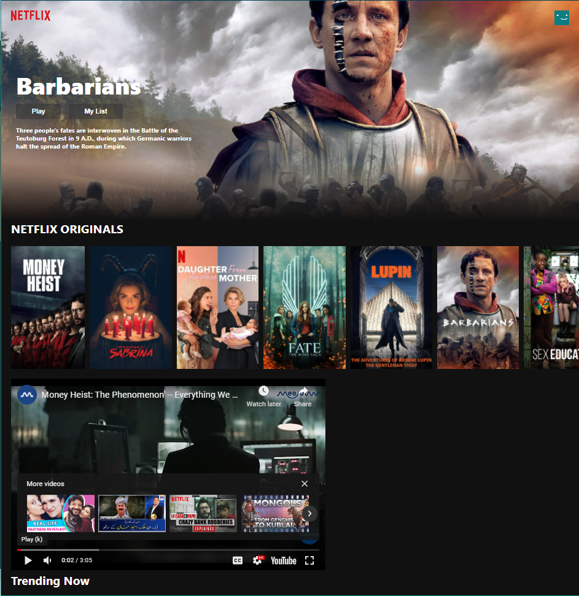

# Netflix Clone

## React

https://www.themoviedb.org/ is used for the API's.

## [Live Site](https://neflix-clone-c4984a.netlify.app/)



# Usage
Replace "Your API KEY" in requests.js, with your API Key. <br />


## Install Dependencies
```
npm install
```

## Run App
```
npm start
```
